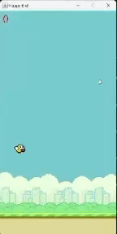

# Flappy Bird Game

## Overview

This project is a simple implementation of the classic Flappy Bird game using Java. The player controls a bird, attempting to fly between sets of pipes without hitting them. The goal is to pass through as many pipes as possible without crashing.

## Features

- **Simple and intuitive controls**: Just use the spacebar to flap the bird's wings.
- **Randomized pipe generation**: Each game session is unique with different pipe placements.
- **Score tracking**: Keep track of your high score as you improve your skills.

## How to Play

- **Controls**: Press the spacebar to make the bird flap its wings and gain altitude. The bird will descend naturally due to gravity.
- **Objective**: Avoid the pipes by flying through the gaps. Each successful pass through a set of pipes increases your score.
- **Game Over**: The game ends if the bird collides with a pipe or the ground.

## Screenshots

## Development

- **Main Class**: `App.java`
- **Game Logic**: `FlappyBird.java`

## Contributing

Feel free to fork this project, make improvements, and submit a pull request. All contributions are welcome!

## Acknowledgements

- The original concept and inspiration for this game come from the popular mobile game "Flappy Bird" by Dong Nguyen.
